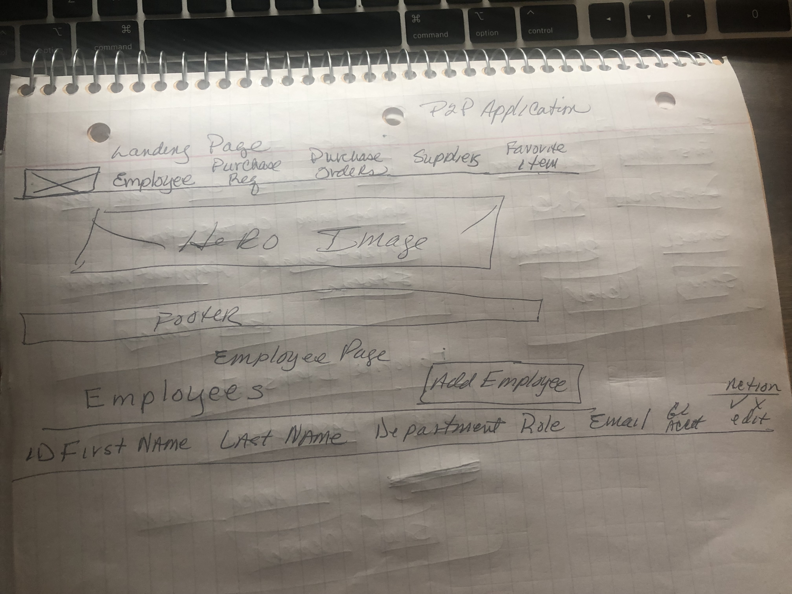
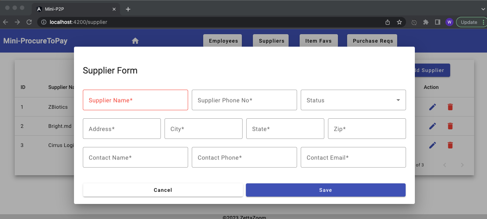

# Mini-Procure To Pay Application
[](https://opensource.org/licenses/MIT)

## Description
A client requested an application which will provide their buyers the flexibility to create a purchase order requisition for indirect goods and services like marketing, media and advertising services or travel, entertainment, or facilities services and converting that request into a purchase order. With more and more of their suppliers requesting cash on delivery, the client is researching ways of streamlining their process of making indirect purchases while maintaining some efficiencies and accountability in their accounts payable process.  With a COD payment terms, the client can pay their suppliers online at the time goods and services are delivered and connect the entire lifecycle of procurement from one phase to the next.

  # Table of Contents
- [Project Planning](#project-planning)
- [User Stories](#user-stories)
- [Technologies Used](#technologies-used)
- [Installation](#installation)
- [Usage](#usage)
- [Wins & Hurdles](#wins--hurdles)
- [Credits](#credits)

## Project Overview
A client requested an application which will provide their buyers the flexibility to create a purchase order requisition for indirect goods and services like marketing, media and advertising services or travel, entertainment, or facilities services and converting that request into a purchase order. With more and more of their suppliers requesting cash on delivery, the client is researching ways of streamlining their process of making indirect purchases while maintaining some efficiencies and accountability in their accounts payable process.  With a COD payment terms, the client can pay their suppliers online at the time goods and services are delivered and connect the entire lifecycle of procurement from one phase to the next.

## Project Planning
<br><br> 
<br><br> 
<br><br> 
<br><br> 

<br><br> 
<br><br> 

## User Stories 

1. Users should be able to create and maintain an employee record.
2. Users should be able to set an employee role as DOA (Delegation Of Authority) or Buyer. 
2. User should be able to assign the DOA (delegation of authority) to a specific GL (General Ledger) expense account.
3. Users should be able to create and maintain a supplier record.
4. Users should be able to create and maintain an item-favorites record.
3. Users should be able to see a listing of all purchase order requisitions.

## Usage
The Mini-ProcureToPay applications user will be to access the Employee, Suppliers, Item Favs, and Purchase Reqs windows from the application's toolbar.

### Home
 <br><br>

### Employee Listing and Edit Windows
 <br><br>
 <br><br>

```
  /**
   * Method calls API to obtain a listing of all employees.
   * @returns
  */
  public getAllEmployees(): Observable<any> {
    return this.http.get(`http://localhost:8080/api/employees/`);
  }

  /**
   * Method calls API to created a new employee record.
   * @param data Employee data to create new employee record.
   * @returns Created employee record.
  */
  public createEmployee(data: any): Observable<any> {
    return this.http.post(`http://localhost:8080/api/employees/`, data);
  }
```

### Suppliers Listing and Edit Windows
 <br><br>
 <br><br>
```
  /**
   * Method calls API to update a specific supplier with specified data elements.
   * @param id Supplier id to update.
   * @param data Supplier data elements to update.
   * @returns Update supplier record.
   */
  public updateSupplierId(id: number, data: any): Observable<any> {
    return this.http.put(`http://localhost:8080/api/suppliers/${id}/`, data);
  }

  /**
   * Method calls API to delete specified supplier record.
   * @param id Supplier id to delete/remove.
   * @returns Supplier record that was deleted.
   */
  public deleteSupplierId(id: number): Observable<any> {
    return this.http.delete(`http://localhost:8080/api/suppliers/${id}/`);
  }
```
### Item Favs Listing & Edit Windows
<br><br>
 <br><br>
```
    /**
    * Method calls API to update a specific item favorite.
    * @param id Item favorite id to update.
    * @param data Item favorite data elements for updating specific item favorite.
    * @returns Updated item favorite record.
    */
    public updateItemFavId(id: number, data: any): Observable<any> {
        return this.http.put(`http://localhost:8080/api/items/${id}/`, data);
    }

    /**
    * Method calls API to delete specified item favorite.
    * @param id Item favorite id to delete/remove.
    * @returns Item favorite was deleted.
    */
    public deleteItemFavId(id: number): Observable<any> {
        return this.http.delete(`http://localhost:8080/api/items/${id}/`);
    }
```
### Purchase Order Reqs Listing Window
 <br><br>
```
    /**
    * Method calls endpoint to obtain all po reqs
    * @returns Listing of all po reqs records.
    */
    public getAllPOReqs(): Observable<any> {
        return this.http.get(`http://localhost:8080/api/po-req/`);
    }
```

## Technologies Used
- Angular
- TypeScript
- Material UI
- HTML/CSS
- Lucidchart

## Installation
1. From the command line, create a local directory where this repo will be cloned.
1. Clone this repository: `git clone <repository-url>`
1. Once cloned, navigate to the directory/folder and install the necessary dependencies from the terminal: `npm install`
1. Run the application from that directory/folder from the terminal: `ng serve`
1. Access the application in your browser at `http://localhost:4200`.
  
## Wins & Hurdles
The project was divided into two phases with the majority of the functionality for the purchase order to be for-filled in the second phase, gratitude lies in being about to get the auxiliary components implement and gaining a better understanding of forms in Angular.  Also, phase 3, will focus on implementing the invoice entry and purchase order matching.

Modeling of the requisition tables and components for them. 

Next Phase;
1. Users should be able to create a purchase requisition while providing the required details.
1. Users of a DOA role should be able to access a list of POs to approve.
1. Users should be able to delete an item from an open purchase order. Users should be able to update detail information on an open purchase order. Users should not be able to update the created date on a purchase order. Users should not be able to update any information on a purchase order once approved or closed.
1. Users should be a to manually associate invoice into system to allow for purchase order matching.


## Credits 
My tech gains are due to the outstanding instructors involved in the 13-week Full-Stack Immersive.  For the many people praying and supporting me from the start and to the end.  For all, of my classmates in this cohort, I appreciate you all.

Instructors:<br>
[Suresh Sigera](https://github.com/sureshmelvinsigera/) <br>
[Leonardo Rodriguez](https://github.com/LRodriguez92)

Resources:<br>
[Java Documentaion](https://docs.oracle.com/en/java/javase/17/docs/api/index.html) <br>
[Spring Framework Documentation](https://docs.spring.io/spring-framework/reference/) <br>
[StackOverFlow](https://stackoverflow.com/) <br>
[Java API](https://docs.oracle.com/en/java/javase/17/docs/api/index.html)

## Contact
- [Wanda Avery](https://www.linkedin.com/in/wanda-simien-avery-48588a1bb)

